# TidyTuesday

These are my contributions based on the weekly challenges from this main repository:
https://github.com/rfordatascience/tidytuesday

I'll be posting on Twitter: @JaimeAAvendano.

---
## April  
<a href="2021_Week_15">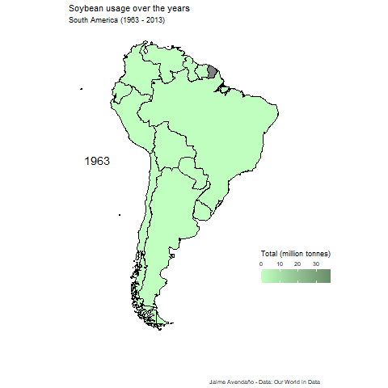</a> 

## March  
<a href="2021_Week_14">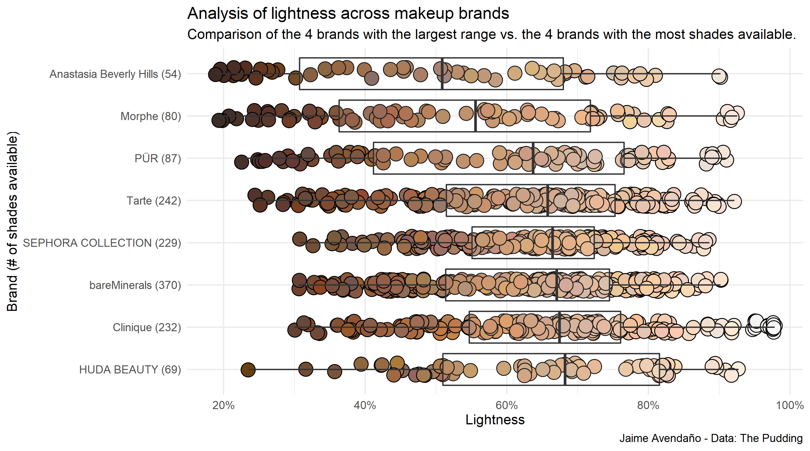</a> 
<a href="2021_Week_13">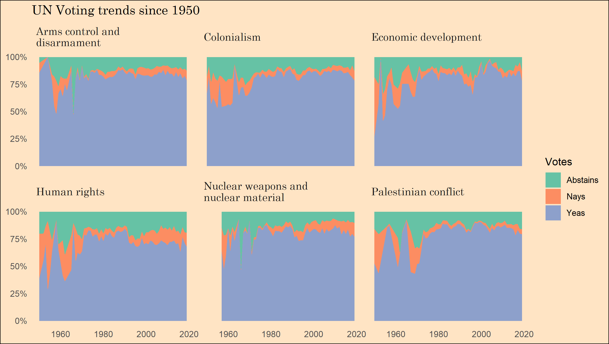</a> 
<a href="2021_Week_12">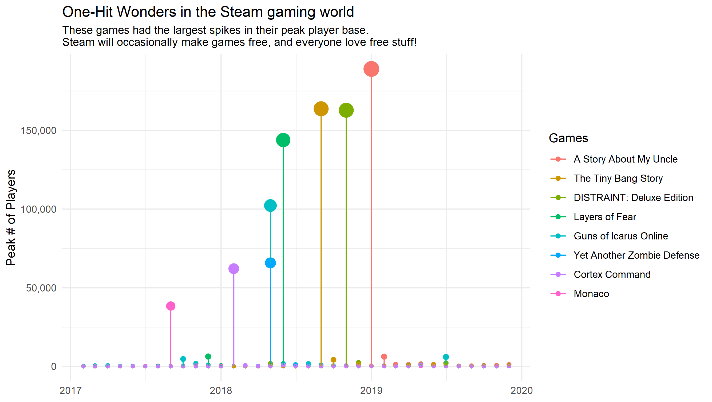</a> 
<a href="2021_Week_11">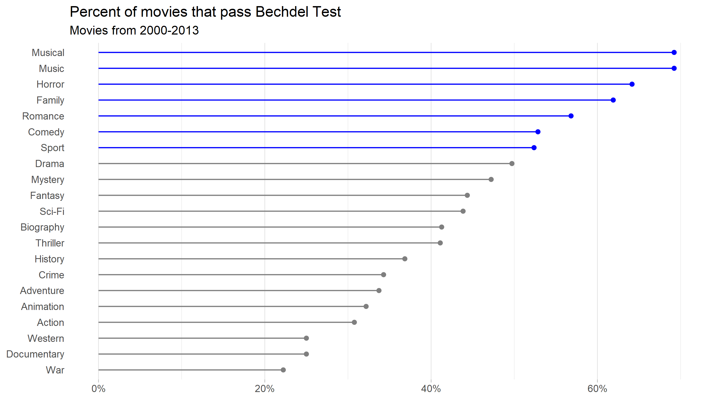</a> 
<a href="2021_Week_10">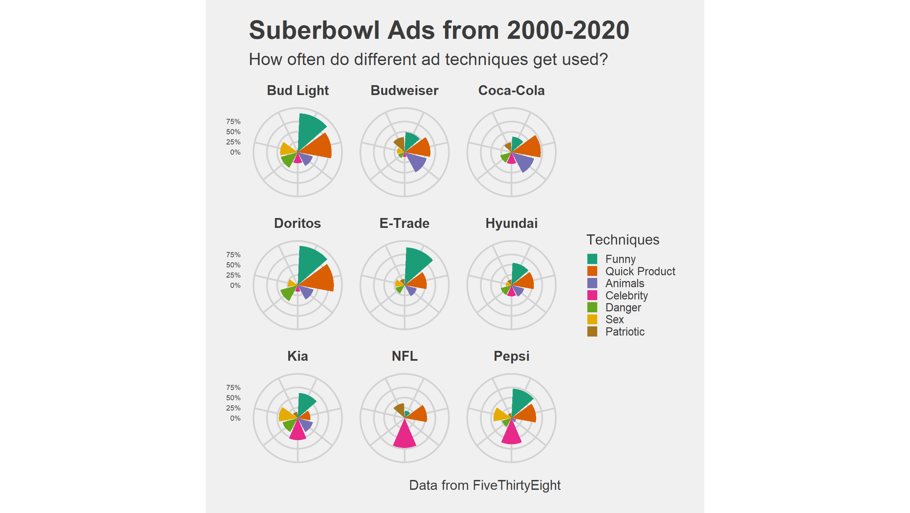</a> 
  
## February  
<a href="2021_Week_08">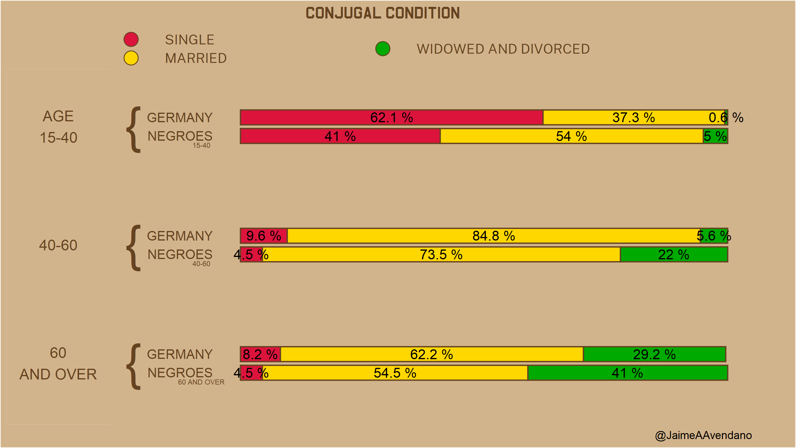</a> 
<a href="2021_Week_07">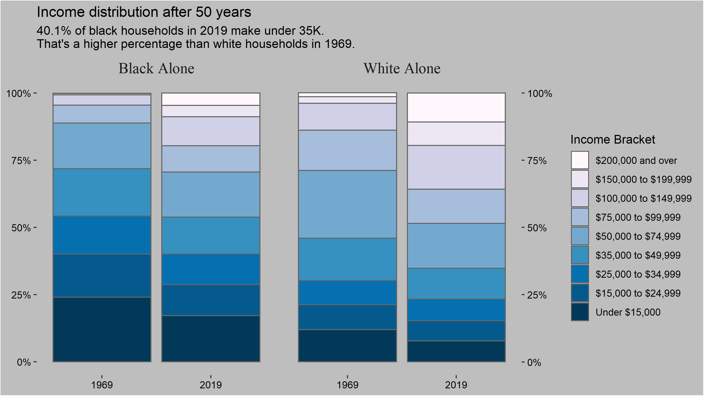</a> 
<a href="2021_Week_06">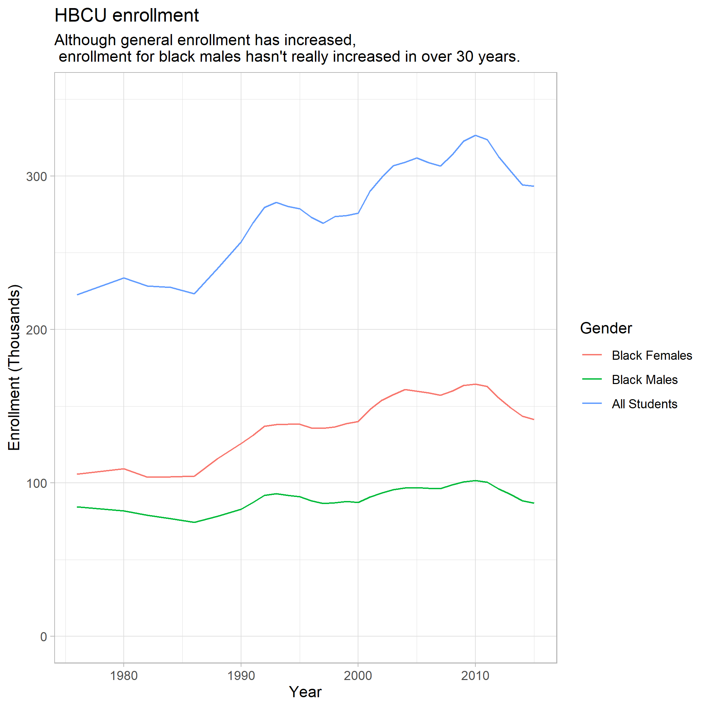</a> 

## January  
<a href="2021_Week_04">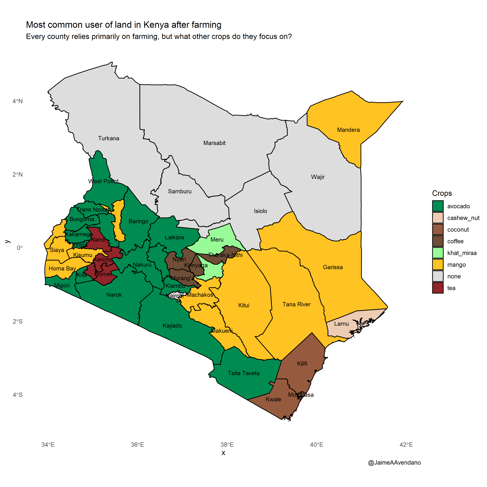</a> 
<a href="2021_Week_03">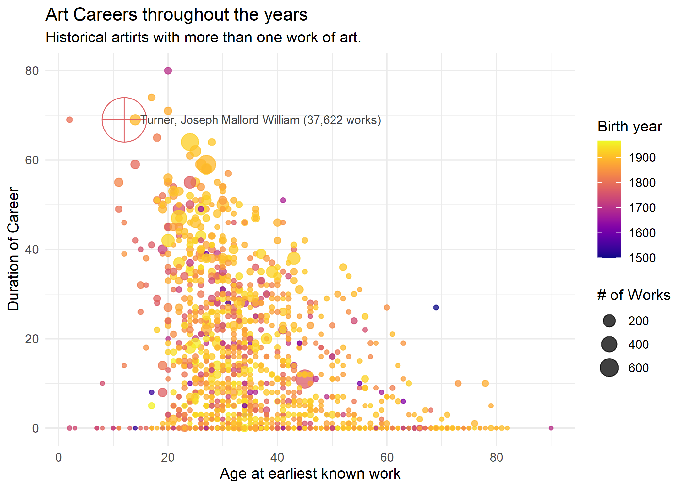</a> 
<a href="2021_Week_02">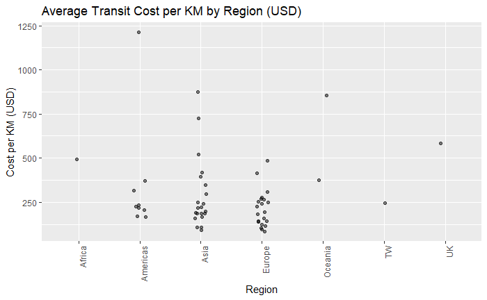</a> 
